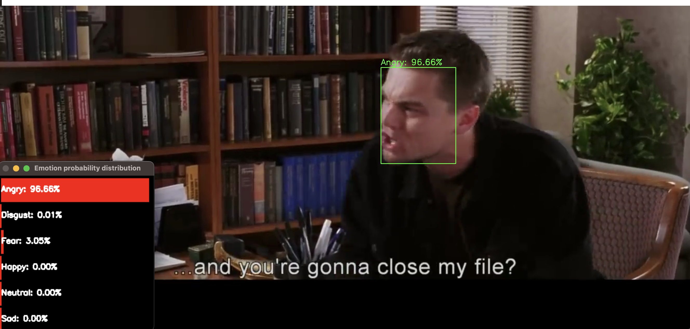
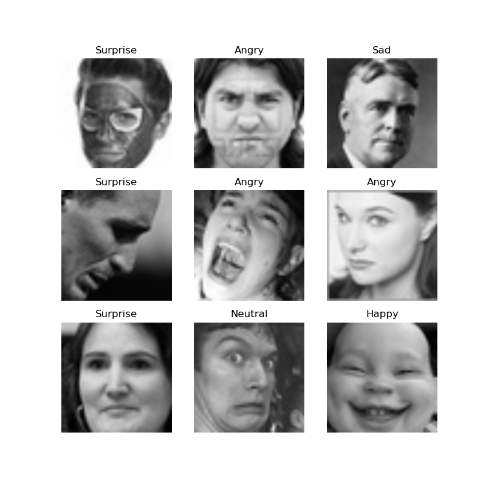
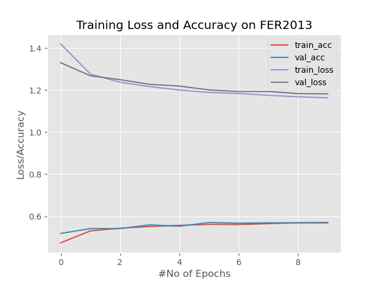
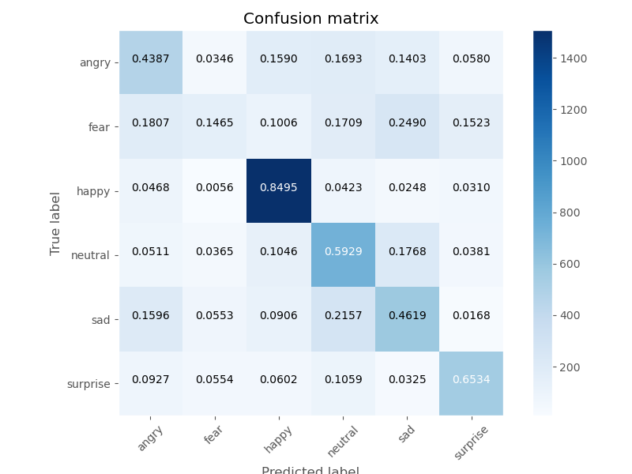
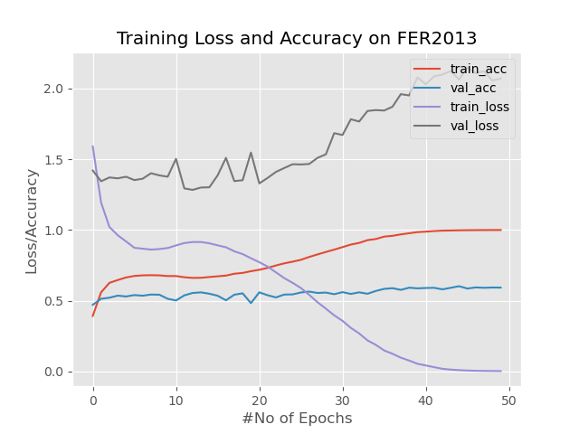
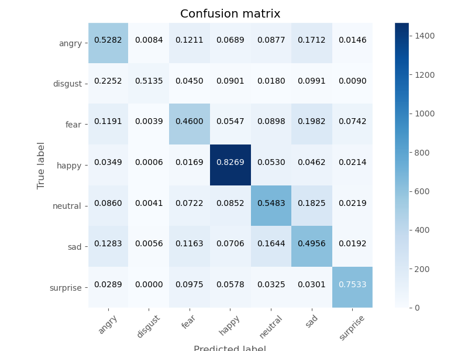
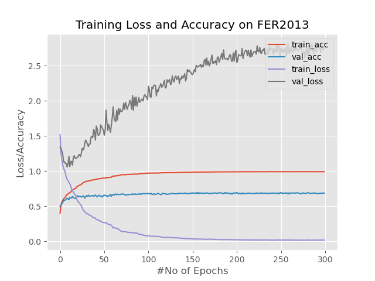
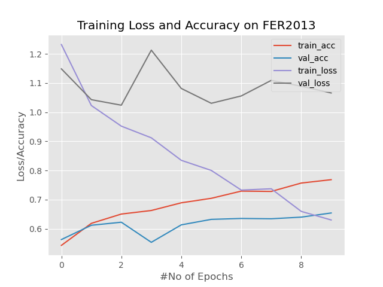

<h2 align="center">Technion's Deep Learning (046211) Project
</h2> 

  

<h4 align="center">
    
    
</a>

</h4>
  

    Itamar Nierenberg: <a href="https://www.linkedin.com/in/itamar-nierenberg-1406261b9/">LinkedIn</a> , <a href="https://github.com/itamarnierenberg">GitHub</a>
   
    Nir Elfasi: <a href="https://www.linkedin.com/in/nir-elfasi-a6a65a281/">LinkedIn</a> , <a href="https://github.com/nirelfasi">GitHub</a>
  

This project is using the FER-2013 dataset without any extra training samples and without uniting any classes. we tried to achieve high accuracy for this data set using CNN architectures and data augmentations.

Table Of Contents
--
* [Background](#background)
* [File Tree](#file-tree)
* [Dataset](#dataset)
* [Augmentations](#augmentations)
* [Architectures](#architectures)
* [Results](#results)
  * [ViT](#vit)
  * [ResNet18](#resnet18)
  * [VGG13](#vgg13)
  * [FaceNet](#facenet)
* [Refrences](#refrences)

## Background
We started this project with the a goal to successfully classify human emotions while training and a limited dataset without adding training data. We tried to implement different modern approaches for image classification in order to compare the results between the different implementations and deciding which is better for this specific task. The initial idea is that this learning procedure is similar to facial recognition in the sense of choice of architecture and training procedure, so models that are trained for facial recognition can be succesfully transfered to perform this sort of classification.

## File Tree
|File Name | Purpose |
|----------|---------|
|`RunTest.ipynb` | The main part of the code, this files loads the dataset performs the data augmentations, calls the training method and then evaluates the results|
|`Config.py`| This file holds all of the project's configurations, parameters such as: which model to currently to train, different scheduler choices, learning rate etc.|
|`HowIFeel.py`| This file holds the class which implements all of the different architectures we used |
|`TrainModel.py`| This file implements the training function for the model|
|`tools.py`| Helper functions to print examples for data or creating goo†d result evaluations|
|`Ensemble.py`| This file implements ensmebling and evaluating a number of pre trained models|
|`DetectFromVideo.py`| This file implements the ability to load a video and a model in order to perform online emotion classification|
|`./faceDetection/architecture.txt`| A prototxt of a pretrained model for facial detection, this model is used to frame faces while performing online emotion classification from videos|
|`./faceDetection/weights.caffemodel`| A caffemodel of a pretrained model for facial detection, this model is used to frame faces while performing online emotion classification from videos |
|`./*Model/`| This directory holds the run results of each model|

## Dataset
The dataset we used for this goal is FER-2013, The data consists of 48x48 pixel grayscale images of faces. The faces have been automatically registered so that the face is more or less centred and occupies about the same amount of space in each image.
The data has 7 classification labels: 0 -> Angry, 1 -> Disgust, 2 -> Fear, 3 -> Happy, 4 -> Neutral, 5 -> Sad, 6 -> Suprise
Number of examples per label:
|Label Name |# Training Examples|
|-----------|-------------------|
|Angry|3593|
|Disgust|385|
|Fear|3691|
|Happy|6473|
|Neutral|4447|
|Sad|2848|
|Surprise|2848|

An example of images from the dataset:

## Augmentations
In order to achieve better generalization and accuracy we decided to use some data augmentations, the augmentations we used and are:
|Augmentation | Purpose |
|-------------|---------|
|Resize|In some cases we used transfer learning from models that get as input a different sized image|
|Grayscale|In some cases we used transfer learning from models that get as input an RGB image|
|RandomHorizontalFlip| To improve generaliztion, since horizontal flip should not effect the emotion classification|
|RandomAffine|To improve generaliztion|
|ColorJitter|To improve generaliztion|

## Architectures
For this classification task we trained a few different models to perform the task, the models we used are:
* ResNet18
* VGG13
* ViT
* FaceNet

## Results

### ViT

  
   

### ResNet18

  
   

Final Test Accuracy = 0.6159097241571468

### VGG13

  
   

Final Test Accuracy = 0.6882139871830594

### FaceNet

  
   

Final Test Accuracy = 0.659375870716077

## Refrences
[1] FER-2013 Dataset: https://www.kaggle.com/datasets/msambare/fer2013

[2] Facial Detection Model: https://www.kaggle.com/datasets/sambitmukherjee/caffe-face-detector-opencv-pretrained-model

[3] Detection from video: https://neuraspike.com/blog/training-emotion-detection-system-pytorch/

